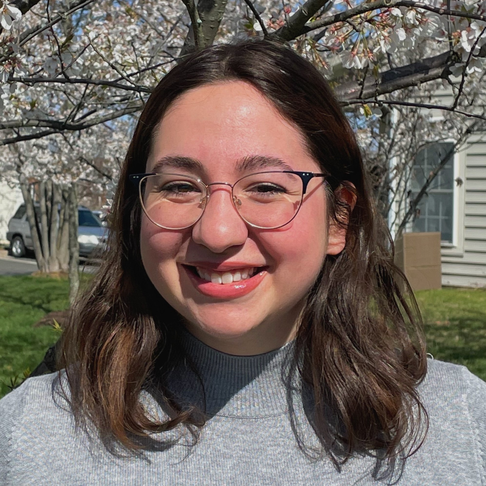

### About me

I am currently pursuing an MPH in Sociomedical Sciences with an Applied Biostatistics and Public Health Data Science Certificate at Columbia University Mailman School of Public Health. I graduated from the University of Virginia with a BS in Biomedical Engineering in 2020. I am passionate about health equity, particularly for LGBTQ+ populations.